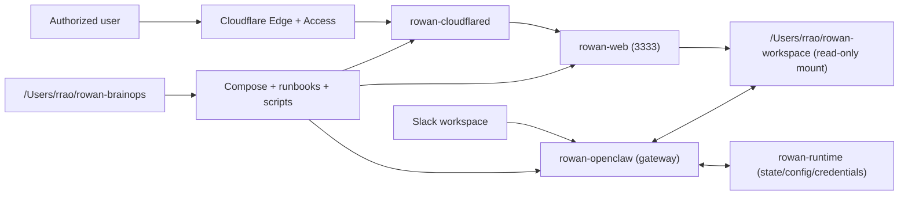

# Rowan Cognitive Architecture

Date: 2026-02-22  
Status: Active baseline for current containerized deployment

## Purpose
This document defines how Rowan is organized as a working cognitive system:
- Metaphorical map (for fast orientation)
- Plain operational map (for implementation and maintenance)
- Clear boundaries between memory, runtime, interfaces, and control planes

## 1) Metaphorical model

Rowan is best treated as a **distributed mind with specialized organs**:

- `rowan-workspace` is **long-term memory**.
  - Durable knowledge, notes, project artifacts, and evolving context live here.
- `rowan-openclaw` is the **cognitive engine**.
  - It reasons, plans, uses tools/channels, and produces responses/actions.
- `Slack` is the **voice and inbox nervous system**.
  - High-availability command/control and lightweight interactions.
- `rowan-web` is the **reading face**.
  - Human-friendly workspace browsing and markdown rendering.
- `cloudflared + Cloudflare Access` are the **immune system and gate**.
  - Only authorized requests reach public surfaces.
- `rowan-brainops` is the **executive function**.
  - Deployment logic, runbooks, change history, and operational discipline.

### Metaphor in one line
`Brain (workspace) + Cognition (openclaw) + Speech (Slack) + Presence (web) + Immune gate (Cloudflare) + Executive control (brainops)`

## 2) Plain operational model

## Repositories and ownership

1. `/Users/rrao/rowan-workspace`
- Role: Core memory/knowledge repository ("brain content")
- Primary contents: docs, tasks, reports, durable notes, project artifacts
- Lifecycle: frequently updated and backed up to GitHub
- Runtime mapping: mounted into containers as workspace data

2. `/Users/rrao/rowan-brainops`
- Role: System operations and architecture control plane
- Primary contents: compose stack, runbooks, docs, scripts, migration journal
- Lifecycle: infrastructure evolution and deployment governance
- Runtime mapping: source of truth for how Rowan is run

3. `/Users/rrao/rowan-runtime` (host state directory)
- Role: Stateful runtime data not intended for source control
- Primary contents: OpenClaw config/state/credentials mounts
- Lifecycle: persistent but operational; backed up separately from git repos

## Runtime components (container level)

1. `rowan-openclaw`
- Function: Agent runtime, tool/channel orchestration, Slack handling
- Depends on: model provider keys, Slack tokens, gateway token, mounted workspace
- Reads/writes: runtime state and credentials under mounted OpenClaw paths

2. `rowan-web`
- Function: Serve workspace content and render markdown for browser use
- Depends on: read-only workspace mount, web allowlist/permissive mode env
- Reads/writes: reads workspace only (no write path)

3. `rowan-cloudflared`
- Function: outbound connector from local stack to Cloudflare edge
- Depends on: tunnel token and Cloudflare tunnel/app routing configuration
- Reads/writes: network connector only; no brain content ownership

## Interaction surfaces

1. Slack (primary chat interface)
- Best for: quick commands, async operations, mobile/travel use
- Limitation: long dev sessions can bloat context and reduce iteration quality

2. Browser via Cloudflare hostname (read/publish surface)
- Best for: viewing workspace content and reports remotely
- Security posture: protected by Cloudflare Access policy

3. Host terminal/editor (deep engineering surface)
- Best for: complex implementation, debugging, long-running dev cycles
- Recommended for: changes that need tight context control and deterministic tooling

## Routing and data flow

## 3) Role boundaries

## What belongs in `rowan-workspace`
- Enduring knowledge and user-facing content
- Project artifacts and memory that should persist across host changes

## What belongs in `rowan-brainops`
- Infrastructure code, deployment scripts, operational docs, architecture decisions
- Migration journals and policy-style notes

## What must stay out of both repos
- Live secrets, provider keys, tunnel tokens, app tokens
- Use `.env` (gitignored), local secret manager workflows, and runtime mounts

## 4) Effective operating model

1. Treat Slack as **operations interface**, not the only engineering interface.
2. Treat `rowan-workspace` as **portable memory substrate**.
3. Treat `rowan-brainops` as **change-control and reliability substrate**.
4. Treat container runtime as **replaceable embodiment**:
- if host changes, rehydrate from:
  - workspace repo clone
  - brainops repo clone
  - secret re-provisioning
  - runtime bootstrap scripts/runbooks

## 5) Known tensions and how we handle them

1. Context ballooning in Slack
- Mitigation: shift deep dev loops to terminal/editor, keep Slack interactions scoped

2. Memory vs configuration split
- Mitigation: explicit boundary between workspace (content) and runtime config/secrets

3. Convenience vs security for web serving
- Mitigation: Cloudflare Access in front; rowan-web mode configurable (allowlist/permissive)

4. Fast iteration vs disciplined history
- Mitigation: journal-first capture, then consolidation into runbooks/reference docs

## 6) Decision checksum (current state)

- Cognitive core is containerized (`rowan-openclaw`)
- Brain content is externalized in separate git repo (`rowan-workspace`)
- Public access path is Cloudflare tunnel + Access to `rowan-web`
- Operational authority is centralized in `rowan-brainops`
- Secrets are intentionally re-bootstrap items and not part of migration artifacts
