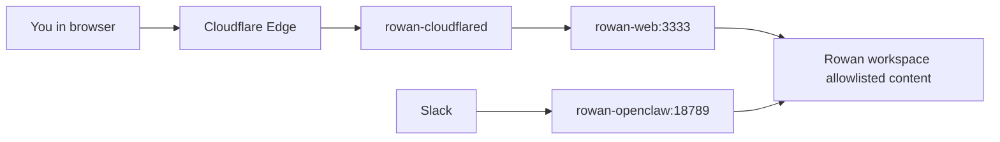

# Current Deployment Guide (Working Baseline)

Date: 2026-02-22
Status: Working in production-like mode

## 1) What is running now

## Runtime
- Host runtime: Colima (Docker context `colima`)
- OpenClaw version: `2026.2.21`
- Stack file: `/Users/rrao/rowan-brainops/compose/docker-compose.yml`

## Services
1. `rowan-openclaw`
- Image: `ghcr.io/openclaw/openclaw:2026.2.21`
- Purpose: agent runtime + Slack channel processing
- Internal endpoint: `ws://127.0.0.1:18789`
- Healthcheck: `GET /` on port `18789`

2. `rowan-web`
- Image: `compose-rowan-web` (local build)
- Purpose: allowlisted static content serving from Rowan workspace
- Healthcheck endpoint: `http://localhost:3333/healthz`
- Allowlist: `apps,docs,reports`

3. `rowan-cloudflared`
- Image: `cloudflare/cloudflared:latest`
- Purpose: Cloudflare tunnel connector from edge to internal services
- Tunnel ingress currently points hostname to `rowan-web:3333`

## Why exactly 3 containers
- Separation of concerns:
  - OpenClaw runtime and channel orchestration
  - content-serving endpoint
  - external ingress connector

## 2) Workspace and brain wiring
- Rowan brain repo is separate on host: `/Users/rrao/rowan-workspace`
- Mounted into OpenClaw at standard path: `/home/node/.openclaw/workspace`
- OpenClaw workspace env: `OPENCLAW_WORKSPACE=/home/node/.openclaw/workspace`
- Rowan web mounts same workspace read-only at `/workspace`

This preserves clean separation:
- Brain content repo stays independent.
- Ops/deploy repo stays independent.

## 3) Routing picture (public and channel paths)


Notes:
- Public hostname route is tunnel-managed and currently targets `rowan-web:3333`.
- Slack traffic does not depend on the web route.

## 4) Access policy behavior (why no challenge appeared)
If two Access apps use the same policy and you already have a valid Access/IdP session, Cloudflare may not prompt again.

That is expected behavior. It does not imply policy bypass by itself.

Validation tip:
- Use a private/incognito browser window to verify challenge behavior explicitly.

## 5) Health commands (quick audit)
Run from `/Users/rrao/rowan-brainops`:

```bash
docker ps --format 'table {{.Names}}\t{{.Image}}\t{{.Status}}'
docker inspect rowan-openclaw rowan-web rowan-cloudflared --format '{{.Name}} Health={{if .State.Health}}{{.State.Health.Status}}{{else}}none{{end}} RestartCount={{.RestartCount}}'
docker logs --since 15m rowan-openclaw
docker logs --since 15m rowan-cloudflared
docker logs --since 15m rowan-web
```

In-container probes:

```bash
docker exec rowan-openclaw sh -lc 'node openclaw.mjs --version'
docker exec rowan-openclaw sh -lc 'wget -q -O - http://localhost:18789/ | head -n 3'
docker exec rowan-web sh -lc 'wget -q -O - http://localhost:3333/healthz'
```

## 6) Known-good configuration decisions
- OpenClaw startup command uses image-native format:
  - `node openclaw.mjs gateway --allow-unconfigured --port 18789`
- OpenClaw config path is `/home/node/.openclaw`.
- OpenClaw model default set to OpenAI path (`openai/gpt-5.2`) after key-mapping fix.
- Slack pairing approved and socket mode connected.
- Slack non-threaded reply preference configured in OpenClaw runtime.

## 7) Operational cautions
- Tunnel token appears in container startup environment logs unless hardened.
- Keep `compose/.env` local-only and never commit.
- Rotate provider and tunnel tokens after major migration events.
- Pin OpenClaw image by digest for stricter supply-chain control.

## 8) Hardening backlog (next pass)
1. Move cloudflared auth to credentials file mount (not token in command/env).
2. Pin `OPENCLAW_IMAGE` to digest, not tag.
3. Add image scan step before upgrades.
4. Add backup/restore rehearsal runbook execution record.

## 9) Commit and push readiness
Repository is prepared for first real commit history with current working deployment state.

Suggested local commit sequence:
1. `docs: capture migration decisions, runbooks, and current deployment guide`
2. `infra: add working single-instance compose stack with rowan-web + cloudflared`
3. `ops: add bootstrap/deploy scripts and slack/cloudflare setup guides`

Push prerequisites:
- add remote for this repo
- push branch to GitHub
